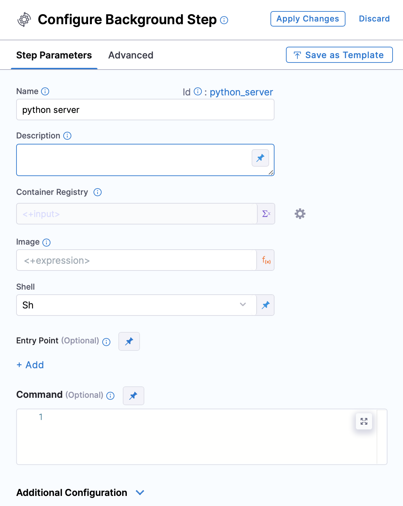

## Introduction

Background steps are useful for running services that need to run for the entire lifetime of a build. This can be used when user wants to run something in background throughout the stage execution or when you want to run an end to end test, redis service or mysql local service to run some operations  

Before diving deep into background step further, let’s talk about service dependencies, how it helped and what were the shortcomings that service dependencies had that we have to introduce the background step 

**Service Dependency** is a detached service that's accessible to all steps in a stage. Service dependencies support workflows such as
- **Integration testing:** You can set up a service and then run tests against this service.
- **Running Docker-in-Docker:** You can set up a dind service to process Docker commands in Run Steps.

Well you can see how important it was to introduce service dependency in your pipeline but then why did we introduce the background step?

Well service dependency did have some shortcomings which background step could solve easily for example:

1. Suppose you want to run a cypress server which needs some custom commands to start, you won’t be able to do that with a service dependency but with a background step as it accepts commands so with the help of that you can write a script and run any service.

2. Suppose you want redis,postgres and node js server to run together,with the help of service dependency you will have to define it separately but with the background step you can easily do that by adding a docker compose file ( the docker file either needs to be downloaded or we can easily use the one present in the git repo) and then doing docker-compose up with the help of command functionality. 

We discussed about some of the shortcomings of service dependency that background step could solve, let’s have a detailed look on three of the major differences between the two:

- **Background step support commands** 

Let’s say you are running some local server and you want to run some pre command or you want to fetch some file before running the server , there is an optional field called command in the background step. With the support of this optional functionality it acts as a run step now .

- **Background step can be added anywhere in the pipeline execution** 

The background step can be added anywhere during the pipeline execution, thus making it flexible for the user.

- **Background step supports Templatization** 

The background step supports templates that can be reused across Pipelines which enhance developer productivity,reduce onboarding time,and enforce standardization across the teams. 
Also ,the background step supports sequential approvals, that is when one step is completed then only you can move to the other step,whereas service dependency was running all the commands at the same time.

To know more about templates visit [Templates](https://docs.harness.io/article/6tl8zyxeol-template).
           
### Some important points:

- A Background step starts a service and then proceeds. For any later step that relies on the service,it is good practice to verify that the service is running before you send requests.

- If the pipeline runs on a VM build infrastructure, you can run the background service directly on the VM rather than in a container.To do this, leave the Container Registry and Image fields blank.
