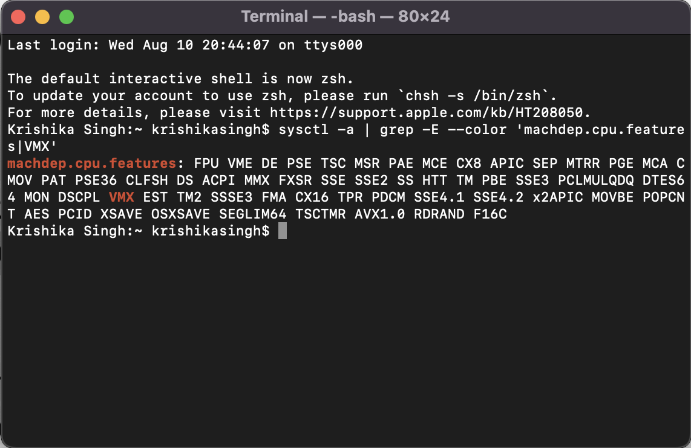

# Installing Harness Kubernetes(K8s) delegate via MiniKube

## Before we begin :
Let us understand what do we mean by delegates and why is it needed 

A Harness delegate is a software that you install in your deployment target environment such as local network ,VPC,or cluster and run as a service.The delegate performs all operations including deployment and integration.
The delegate connects all your artifacts,infrastructure,collaboration,verification and other providers with the Harness Manager.


Below we have discussed the detailed explanation of how we can install Kubernetes(K8s) delegate.

## Prerequisites 
- First check if virtualization is available in your local machine

  ```sysctl -a | grep -E --color 'machdep.cpu.features|VMX'```

-  If you see VMX highlighted in your terminal then VT-x feature is enabled in your machine.



- In windows you can check via running following commands in the command prompt and see if virtualization is available:

    ```systeminfo```

- Install kubectl (kubernetes command line )  
  * Mac - ```brew install kubectl```
  * Windows - For windows you can refer to the following docs for detailed instructions regarding installation:
   [Kubectl-Windows](https://kubernetes.io/docs/tasks/tools/install-kubectl-windows/)


- Installing hypervisor -
 * You can install any 3 of these :
   1. Hyperkit
   2. VirtualBox
   3. VMWare Fusion 
     
     Here we are using hyperkit 
 * Mac - ```brew install hyperkit```
 * Windows -

   1. Install chocolatey package manager in windows using the following command:
      ``` @"%SystemRoot%\System32\WindowsPowerShell\v1.0\powershell.exe" -NoProfile -InputFormat None -ExecutionPolicy Bypass -Command "iex ((New-Object System.Net.WebClient).DownloadString('https://chocolatey.org/install.ps1'))" && SET "PATH=%PATH%;%ALLUSERSPROFILE%\chocolatey\bin"```

   2. Installing Hyper-V in windows:
      Check the following docs for detailed instruction regarding installation:
      [Hyper-V in Windows](https://docs.microsoft.com/en-us/virtualization/hyper-v-on-windows/quick-start/enable-hyper-v)

- Installing minikube 
   * Mac - ```brew install minikube``` 
   * Windows -   Follow the following instructions for installation :
    


- Starting the Minikube

   1. Mac and windows -  ```minikube start```
   


## Installing Harness Delegate

- Go to  [Harness](https://app.harness.io)

- Go to Builds and under Project setup click delegates and then click on new delegates 


- Click on kubernetes

   

- **Name** your delegate and select the **size of delegate** and also select delegate permissions.
Please follow the correct naming convention for naming a delegate.
   - It will show error when you insert any special characters except ‘-’ and make  sure name should not start or end with a number 
  

### NOTE:These sizing requirements are for the Delegate only.Your cluster will require more memory for Kubernetes, the operating system, and other services,preferably one should have double the memory and node present in the cluster than that of required for the delegate for smooth functioning.

- Download the yaml file
  

- After clicking on continue open the new terminal and open the directory where you have downloaded the yaml file  and then run the following command:

    ```kubectl apply -f harness-delegate.yml```

  

- It may take few minutes for verification,after successful installation of delegate following message will be displayed:


- You can go to the delegate section in the project setup and see the delegate you have installed:


- You can also delete your delegate when no longer in use  

## Note: Our Kubernetes Delegates are immutable , that is you can only create and delete the delegate but you can’t make any changes to them . 

