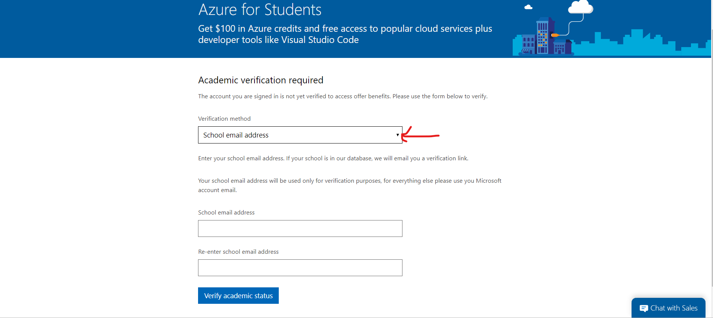
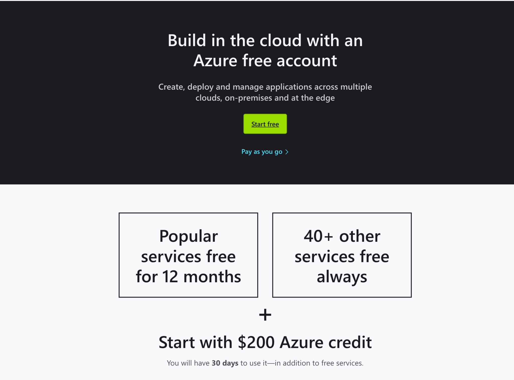
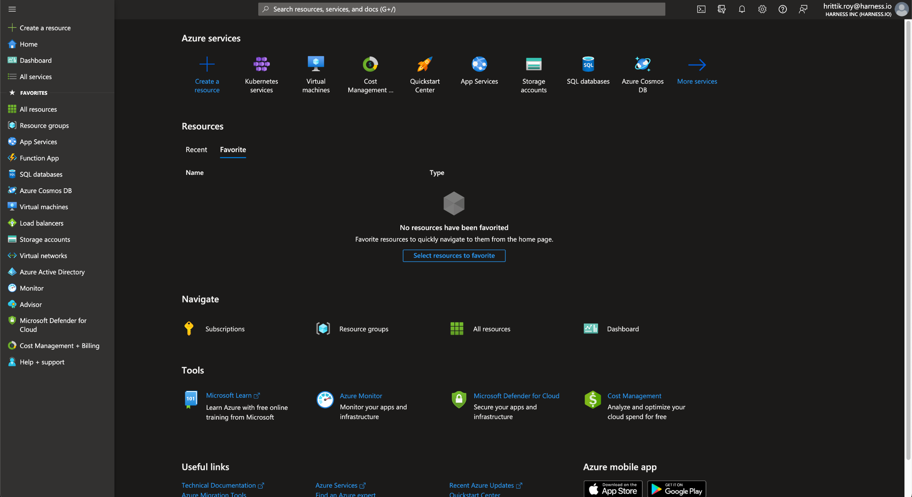
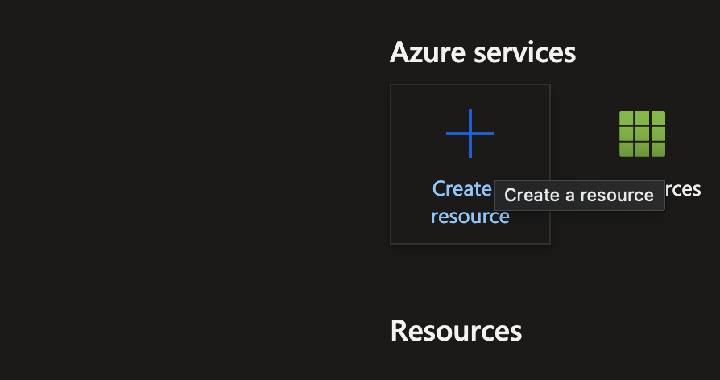
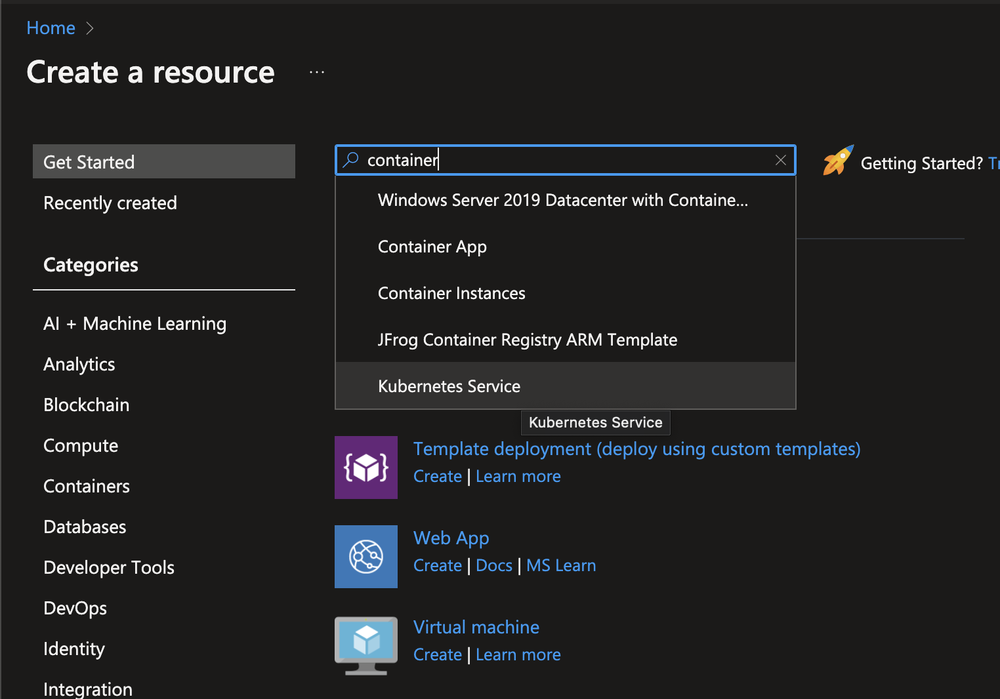
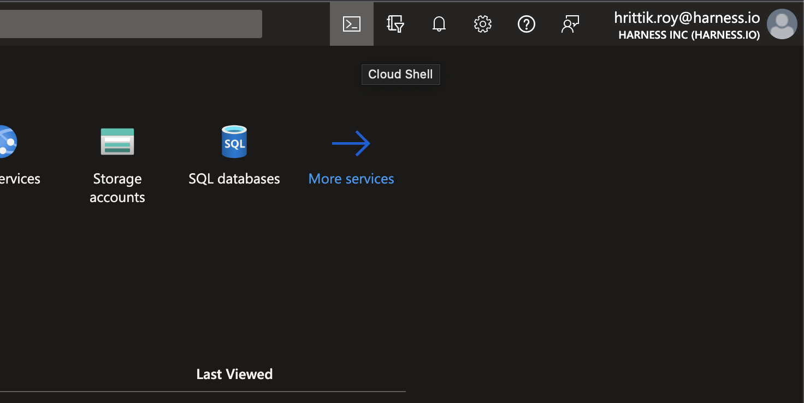

Creating a delegate requires the creation of an infrastructure in which computational tasks can take place. The infrastructure is typically a Kubernetes cluster.

This tutorial shows you how to set up a Kubernetes cluster on Azure and will serve as the foundation for your CI/CD pipeline infrastructure. After the infrastructure is ready on a free account, you can proceed to create and install a Delegate.

## Student Account

If you’re a student, you’re in luck as there is [Azure for Students](https://azure.microsoft.com/en-us/free/students/) where you can sign in with your educational email address to create an account without a credit card to get $100 worth of credits.

These credits can be used to deploy the Kubernetes Cluster and other services if required. 

To, get started with the account creation go to Azure for Students.

Step 1: Click on Activate Now

Step 2: After signing in with a Microsoft account, enter your educational email address:

Step 3: Sign in to Azure Portal!

## A free Azure Account

For anyone who can verify their identity with a phone number and a credit card, Azure offers a free account with $200 in Azure credit. Once your account has been verified, you can create a Kubernetes cluster in it.

Step 1: Go to the [Azure Free Account Page](https://azure.microsoft.com/en-in/free/)

Step 2: Click on Start free to start the account creation procedure 

Step 3: Fill in the following fields

Step 4: Once your details are in click on Sign Up after you have accepted the terms and conditions. 

Step 5: Verify your phone number

Step 6: Put in your CC details and depending upon your Region a small amount will be deducted and refunded for verification. 

Step 7: You can access your account using the [Azure Portal](https://portal.azure.com/)

## Azure Portal

Azure portal is the web-based management console for Microsoft Azure. It provides a single, unified view of all your Azure resources, including compute, storage, networking, and security. You can use the Azure portal to deploy and manage your Azure resources and to monitor their health and usage. 

You will use the portal to create your Kubernetes Cluster and connect to it.

## Create a Cluster

The steps to create a cluster will be to use the Azure Kubernetes Service which is the managed Kubernetes offering from Azure. The steps are as follows:

Step 1: Click on Create a Resource after signing in

Step 2: Search Container and then click on `Kubernetes Service`

Step 3: Click on Create

Step 4: On the Basics page, configure the following options for a Delegate to Run:

* Project details:
    * Select an Azure Subscription.
    * Select or create an Azure Resource group, such as DelegateGroup.
* Cluster details:
    * Enter a Kubernetes cluster name, such as myEnviroment.
    * Select a Region for the AKS cluster
    * Select 99.5% for API server availability for lower cost
* Go to Scale Method and make it to  Manual. Next change the Node Count to 2 as your account might not have sufficient resource!

Step 5: Start the resource validation by clicking Review + Create on your portal. Once validated, click Create to begin the process of cluster creation. Wait a few minutes for the cluster to deploy.

## Connect to your cluster

Now, when your cluster is ready you can connect to the Azure Cloud Shel on your portal and open the terminal!

Navigate to your cluster and click on Connect!

Follow the steps displayed on the right panel and then you can connect to your cluster! 

Run `kubectl cluster-info` to display details on your cluster!

## Next Steps

Now that your cluster is operational, you may add resources to it by using the kubectl utility, as you can see. Please use [Start Deploying in 5 Minutes with a Delegate-first Approach](https://www.harness.io/technical-blog/deploy-in-5-minutes-with-a-delegate-first-approach) tutorial to install Delegate at this time and move forward with creating your CI/CD pipeline.

## Need further help?

Feel free to ask questions at [community.harness.io](https://community.harness.io/c/harness/7) or [ join community slack](https://join.slack.com/t/harnesscommunity/shared_invite/zt-y4hdqh7p-RVuEQyIl5Hcx4Ck8VCvzBw) to chat with our engineers in product-specific channels like:

* [#continuous-delivery](https://join.slack.com/t/harnesscommunity/shared_invite/zt-y4hdqh7p-RVuEQyIl5Hcx4Ck8VCvzBw)  Ask questions/help other users regarding CD Module of Harness.
* [#continuous-integration](https://join.slack.com/t/harnesscommunity/shared_invite/zt-y4hdqh7p-RVuEQyIl5Hcx4Ck8VCvzBw) Ask questions/help other users regarding CI Module of Harness.
