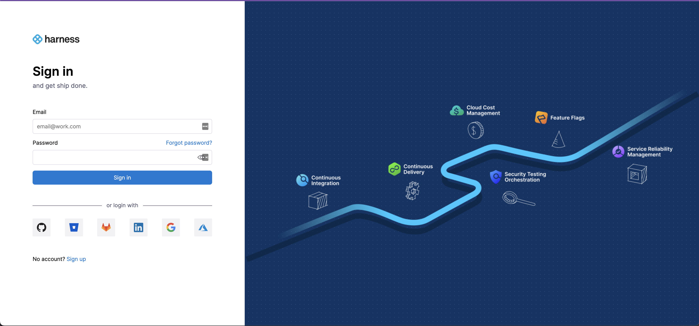
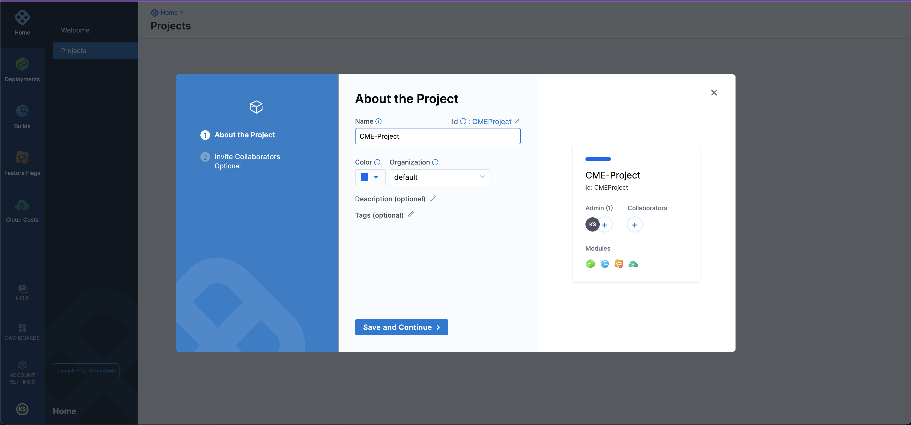
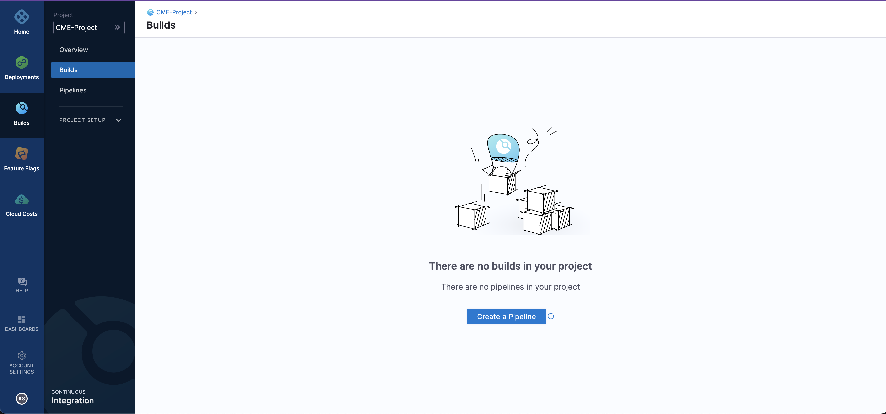
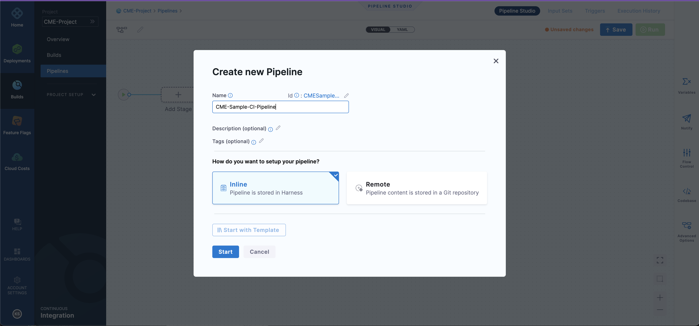
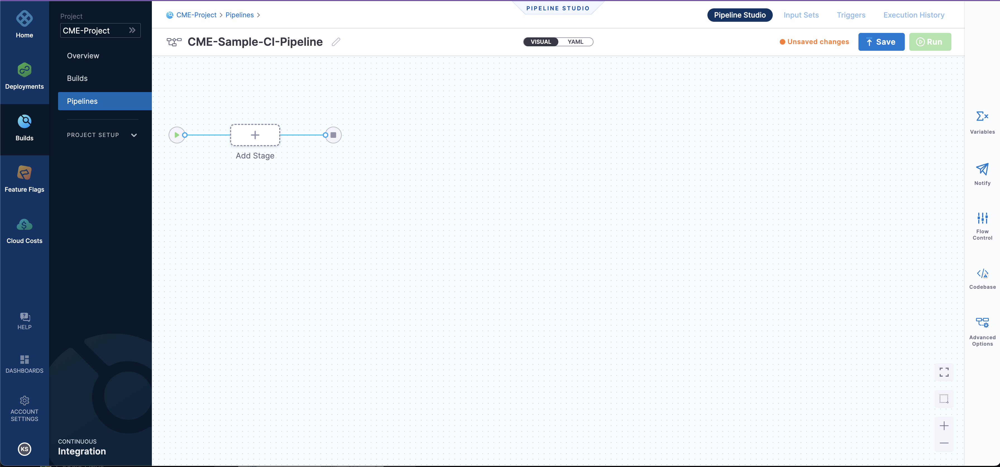
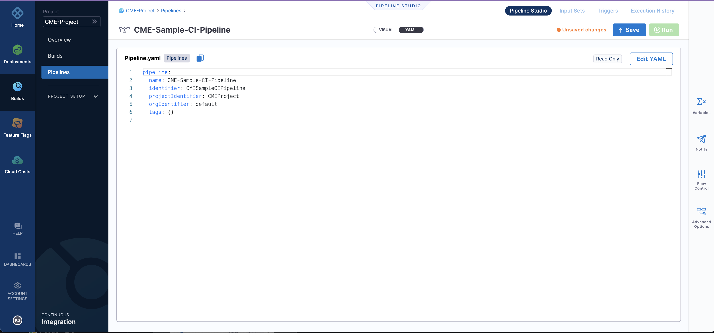
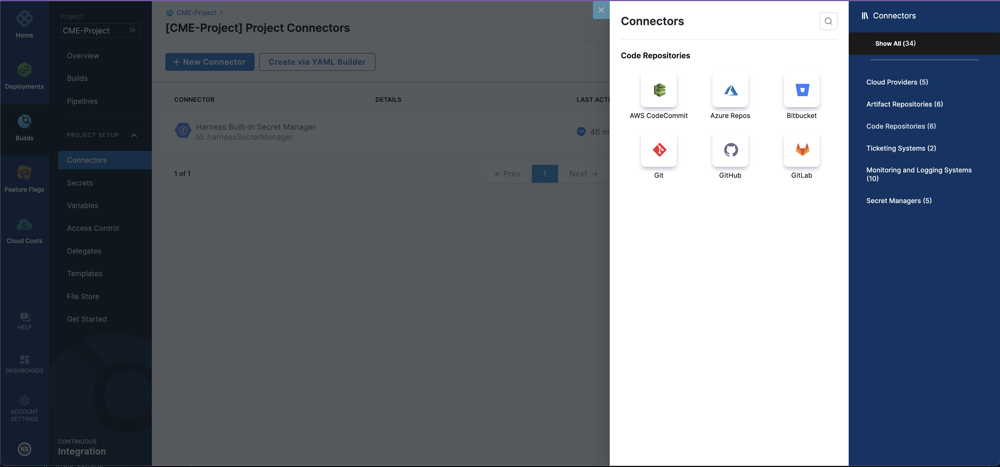
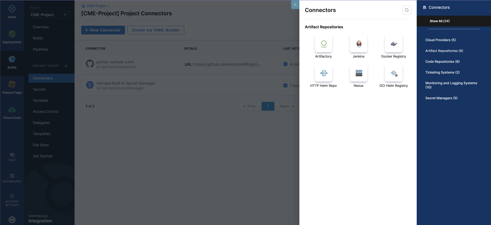
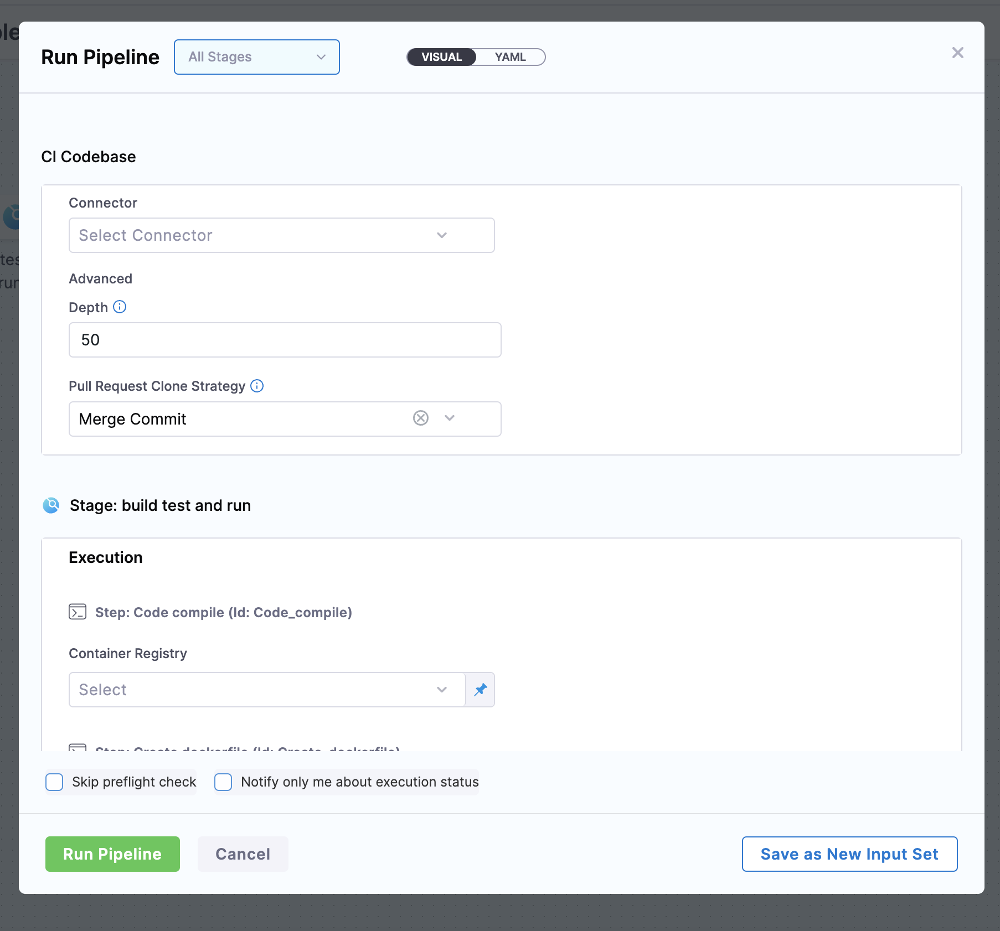

# Python Yaml Onboarding for beginners 

In this blog ,we are going to talk about how easily you can set up your pipeline using YAML.


Harness includes visual and YAML editors for creating and editing Pipelines, Triggers, Connectors, and other entities. Everything you can do in the visual editor you can also do in YAML.


For detailed information about using Harness YAML visit [Harness YAML Reference](https://docs.harness.io/article/xs2dfgq7s2-yaml-reference-cd-pipeline) and [Harness YAML Quickstart](https://docs.harness.io/article/1eishcolt3-harness-yaml-quickstart).

## Before we begin 

Make sure you have the following set up before you begin this tutorial:

- Github Account: This tutorial clones a codebase from a Github repo. You will need a Github account so Harness can connect to Github.
- Docker Hub account and repo: You will need to push and pull the image you build to Docker Hub. You can use any repo you want, or create a new one for this tutorial.

## Getting Started

- Fork the repository

  For this demo we are using [Python-pipeline-samples](https://github.com/harness-community/python-pipeline-samples).

- Login into Harness UI

   * Go to [Harness](https://app.harness.io).
   
   * Sign up to the Harness platform.
   * Once you signup you will enter the Harness UI as shown below.
   
   * Go to `Builds` and select `Create a Project`.
     * Give the name of the Project -> `Save and Continue`
     * You can also invite collaborators , it's optional.
        
   * After `Save and Continue` select module as `Continous Integration`.

     After selecting module as Continous Integration you will see the screen as shown in the below screenshot.
     
   * Select `Create a Pipeline`.
     * Name your `Pipeline`. 
     * Choose the setup as `Inline`. 
     * Select `Start`.
     Refer to the below sceenshot:
     


## Getting Started

* After Creation of Pipeline , you will enter into the pipeline studio as shown below

* As you can see in the pipeline studio we have two options , one is `VISUAL` and other is `YAML`.
Naviagte to the YAML editor,as shown below.

* Copy and Paste the below YAML file into the editor.

Note:- Paste the below YAML file just below the ``tags{}``.

```
  properties:
    ci:
      codebase:
        connectorRef: <+input>
        build: <+input>
        depth: <+input>
        prCloneStrategy: <+input>
  stages:
    - stage:
        name: build test and run
        identifier: build_test_and_run
        type: CI
        spec:
          cloneCodebase: true
          infrastructure:
             type: KubernetesHosted
             spec:
               identifier: k8s-hosted-infra
          execution:
            steps:
              - step:
                  type: Run
                  name: Code compile
                  identifier: Code_compile
                  spec:
                    connectorRef: <+input>
                    image: python:3.10.6-alpine
                    shell: Sh
                    command: python -m compileall ./
              - step:
                  type: Run
                  name: Create dockerfile
                  identifier: Create_dockerfile
                  spec:
                    connectorRef: <+input>
                    image: alpine
                    shell: Sh
                    command: |-
                      touch pythondockerfile
                      cat > pythondockerfile <<- EOM
                      FROM python:3.10.6-alpine
                      WORKDIR /python-pipeline-sample
                      ADD . /python-pipeline-sample
                      RUN pip install -r requirements.txt
                      CMD ["python3" , "./app.py"]
                      EOM
                      cat pythondockerfile
              - step:
                  type: BuildAndPushDockerRegistry
                  name: Build and Push an image to docker registry
                  identifier: Build_and_Push_an_image_to_docker_registry
                  spec:
                    connectorRef: <+input>
                    repo: <+input>
                    tags:
                      - latest
                    dockerfile: pythondockerfile
                    optimize: true
        variables:
          - name: container
            type: String
            description: ""
            value: docker
    - stage:
        name: Integration test
        identifier: Integration_test
        type: CI
        spec:
          cloneCodebase: true
          infrastructure:
            useFromStage: build_test_and_run
          execution:
            steps:
              - step:
                  type: Background
                  name: "python server "
                  identifier: python_server
                  spec:
                    connectorRef: <+input>
                    image: <+input>
                    shell: Sh
                    command: python3 ./app.py
              - step:
                  type: Run
                  name: "test connection to server "
                  identifier: test_connection_to_server
                  spec:
                    connectorRef: <+input>
                    image: curlimages/curl:7.73.0
                    shell: Sh
                    command: |-
                      sleep 10
                      curl localhost:5000

```
* Click on `Save`.

  Naviagte to `VISUAL` and now you can see your two stage pipline ready as shown below in the screenshot. That's the beauty of YAML in Harness.

  

  You can navigate through all the steps in the pipeline and explore the pipeline.

## Inputs 
Before running the pipeline,let's create a Github and Docker connector. 

* Github Connector

  Under Project setup select `Connectors`.

  Click on `+ New Connector`

  Select `Code Repositories` and Choose `Github`.

  You can refer to the below screenshot.
  
  
  Change the Connector settings as follows:


   1. Overview

      Name: `python-sample-connector`

      Select `Continue`.
   2. Details

      URL Type : `Repository`

      Connection Type: `HTTP`

      GitHub Repository URL: Paste the link of your forked repository

      Select `Continue`.
   3. Credentials

      Username: (Your Github Username)

      Personal Access Token: [Check out how to create personal access token](https://docs.github.com/en/authentication/keeping-your-account-and-data-secure/creating-a-personal-access-token)
     
      Secret Name: `Git-Token`

      Secret  Value: PAT value generated in Github

      Select `Enable API access (recommended)`

      Under `API Authentication`-> `Personal Acess Token` select the name of the secret created in the previous step.

      Select `Continue`.
    
   4. Select Connectivity Mode

      Under `Connect to the provider`-> Select `Connect through Harness Platfrom`.

      Select `Save and Continue`.
   
   5. Connection Test 
      
      You will see `Verification Successful` that means your connector is connected successfully to your codebase.

      For reference you can also checkout this video on our Harness Community youtube channel 
     

      <iframe width="640" height="480" src=" https://www.youtube.com/embed/0UHBK4vfzcI" frameborder="0" allow="autoplay; encrypted-media" allowfullscreen > </iframe>


      To develop more understanding on Connectors [check out the docs here](https://docs.harness.io/category/o1zhrfo8n5-connectors)

* Create a Docker Connector

  Under Project setup select `Connectors`.

  Click on `+ New Connector`

  Select `Artifacts Repositories` and Choose `Docker Registry`.

  You can refer to screenshot below

  

  Change the settings as following 
   
   1.   Overview 
        Name- `docker quickstart`

   2.    Details 
         - Docker registry url -  `https://index.docker.io/v1/`
         - Provider type - `Docker Hub`
         - Authentication - `Username and Password`
         - Username - Docker hub username 
         - Secret Token - [Check out how to create docker PAT](https://github.com/harness-community/python-pipeline-samples/blob/main/docs/DockerPat.md)
  
   3.    Select Connectivity Mode
         
         Under `Connect to the provider`-> Select `Connect through Harness Platfrom`.

         Select `Save and Continue`.
         
            

         
     For your reference you can also checkout this video on our Harness Community YouTube channel:

     <iframe width="640" height="480" src="https://www.youtube.com/embed/zJ--nKMCdZQ" frameborder="0" allow="autoplay; encrypted-media" allowfullscreen > </iframe>

* Create a Docker Repository

  1. Login to [Docker Hub](https://hub.docker.com)
  2. Go to `Repositories` -> Select `Create Repositories`.
  3. Give a name to your repository and you can choose whether you want you repo to be public or repo.

## Run the Pipeline

Navigate back to the `Pipeline studio` and click on `Run`.

On Clicking, you will see a page asking for inputs so as to run the pipeline, you can refer to the below screenshot



1. CI Codebase 

   - `Connector`- Selelct the `Github Connector` you created in the previous step.

2. Stage: build test and run
   
   Step: Code compile

   - `Conatiner Registry`- Select the `Docker Connector` you created in the previous step.
   
   Step: Create dockerfile

   - `Conatiner Registry`- Select the `Docker Connector`.

   Step: Build and Push an iamge to Docker Registry

   - `Docker Connector`- Select the `Docker Connector`.
   - `Docker Repository`- `docker-hub-username/repository-name`

3. Stage: Integeration Test

   Execution

   Step: pyhton server

   - `Container registry`- Select the `Docker Connector`.
   - `Image`- `docker-hub-username/repository-name`

   Step: test connection to server

   - `Container registry`- Select the `Docker Connector`.


Click on `Run Pipeline`.

It will take around less than 3 mins to execute your Pipeline. 

After successful completion and execution of all the steps you will see something similar to this:


This article expalined YAML based onboarding process, if you want to try out Harness UI based onoboarding do checkout this tutorial:-

 <iframe width="640" height="480" src="https://www.youtube.com/embed/r1GLYtOmJmM" frameborder="0" allow="autoplay; encrypted-media" allowfullscreen > </iframe>


